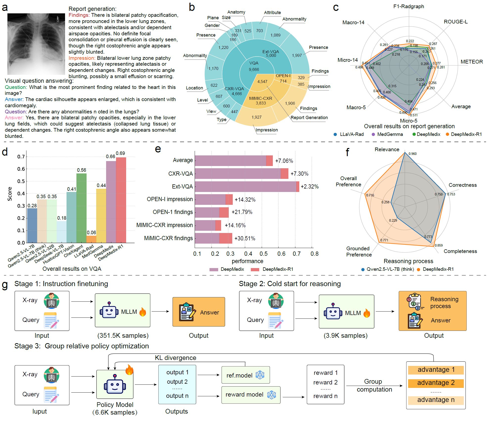

<h1 align="center">
A Foundation Model for Chest X-ray Interpretation with Grounded Reasoning via Online Reinforcement Learning
</h1>

<p align="center">
  <a href=""><b>[📜 Paper]</b></a> •
  <a href="https://github.com/DeepReasoning/DeepMedix-R1"><b>[🐱 GitHub]</b></a>
  
</p>

<p align="center">
Repo for "<a href="" target="_blank">A Foundation Model for Chest X-ray Interpretation with Grounded Reasoning via Online Reinforcement Learning</a>"
</p>

<!--
## 🔥 News

- [2025/02] 🔥🔥🔥 Logical reasoning evaluation study of LLMs is accepted by IEEE TKDE!
--> 


## 📖 Introduction


Medical foundation models (FMs) have shown tremendous promise amid the rapid advancements in artificial intelligence (AI) technologies. However, current medical FMs typically generate answers in a black-box manner, lacking transparent reasoning processes and locally grounded interpretability, which hinders their practical clinical deployments. To this end, we introduce DeepMedix-R1, a holistic medical FM for chest X-ray (CXR) interpretation. It leverages a sequential training pipeline: initially fine-tuned on curated CXR instruction data to equip with fundamental CXR interpretation capabilities, then exposed to high-quality synthetic reasoning samples to enable cold-start reasoning, and finally refined via online reinforcement learning to enhance both grounded reasoning quality and generation performance. Thus, the model produces both an answer and reasoning steps tied to the image’s local regions for each query. Quantitative evaluation demonstrates substantial improvements in report generation (e.g., 14.54% and 31.32% over LLaVA-Rad and MedGemma) and visual question answering (e.g., 57.75% and 23.06% over MedGemma and CheXagent) tasks. To facilitate robust assessment, we propose Report Arena, a benchmarking framework using advanced language models to evaluate answer quality, further highlighting the superiority of DeepMedix-R1. Expert review of generated reasoning steps reveals greater interpretability and clinical plausibility compared to established Qwen2.5-VL-7B model (0.7416 vs. 0.2584 overall preference). Collectively, our work advances medical FM development toward holistic, transparent, and clinically actionable modeling for CXR interpretation.


## 🚀 DeepMedix-R1


<p align="center">
    
</p>


<!--
## Citation

If you find it helpful, please kindly cite the paper.

```
@article{DBLP:journals/corr/abs-2306-09841,
  author       = {Fangzhi Xu and
                  Qika Lin and
                  Jiawei Han and
                  Tianzhe Zhao and
                  Jun Liu and
                  Erik Cambria},
  title        = {Are Large Language Models Really Good Logical Reasoners? {A} Comprehensive Evaluation and Beyond},
  journal      = {IEEE Transactions on Knowledge and Data Engineering},
  volume       = {37},
  number       = {4},
  pages        = {1620--1634},
  year         = {2025}
}
```
--> 

